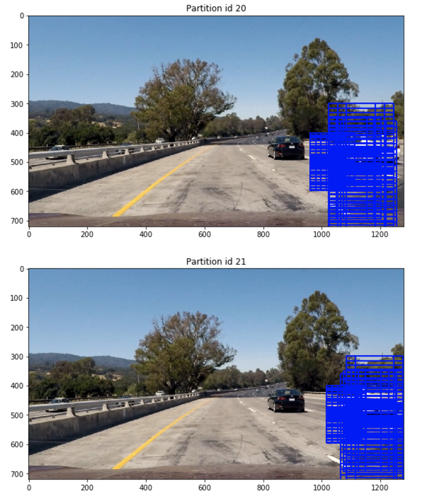
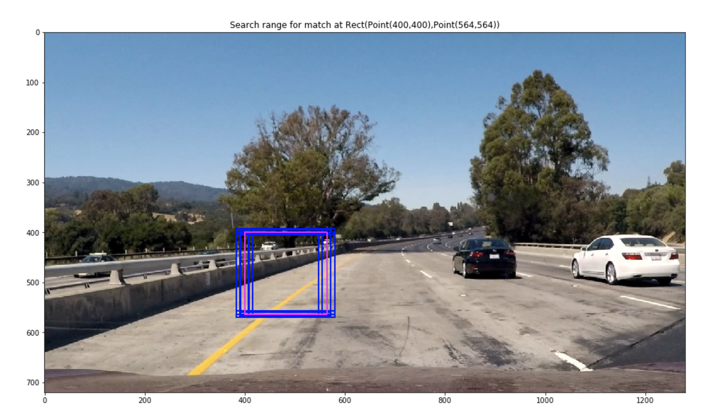
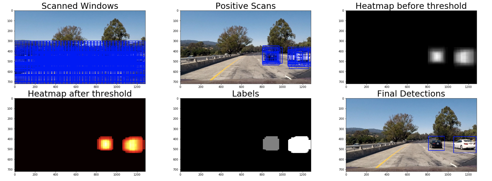
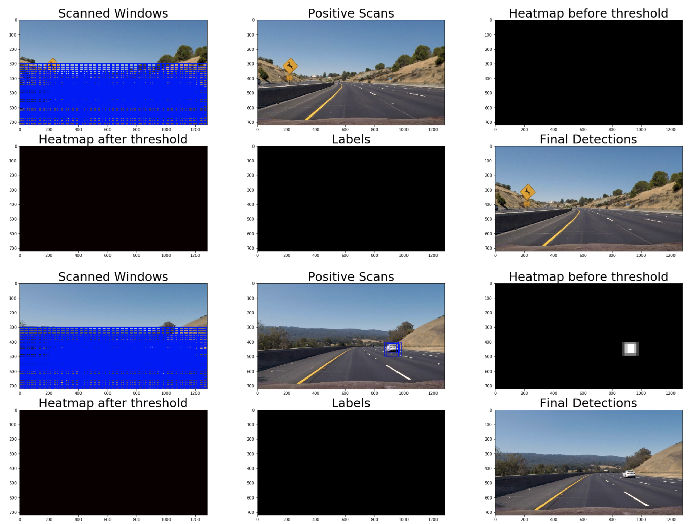
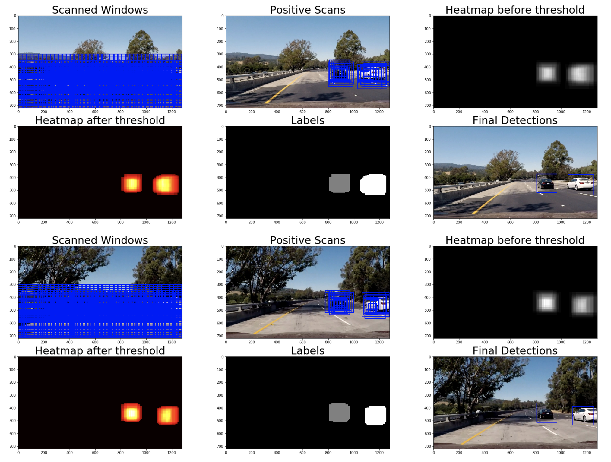
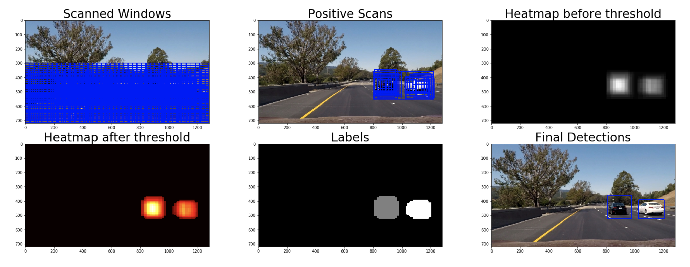

## Writeup Template
### You can use this file as a template for your writeup if you want to submit it as a markdown file, but feel free to use some other method and submit a pdf if you prefer.

---

**Vehicle Detection Project**

The goals / steps of this project are the following:

* Perform a Histogram of Oriented Gradients (HOG) feature extraction on a labeled training set of images and train a classifier Linear SVM classifier
* Optionally, you can also apply a color transform and append binned color features, as well as histograms of color, to your HOG feature vector. 
* Note: for those first two steps don't forget to normalize your features and randomize a selection for training and testing.
* Implement a sliding-window technique and use your trained classifier to search for vehicles in images.
* Run your pipeline on a video stream (start with the test_video.mp4 and later implement on full project_video.mp4) and create a heat map of recurring detections frame by frame to reject outliers and follow detected vehicles.
* Estimate a bounding box for vehicles detected.

## [Rubric](https://review.udacity.com/#!/rubrics/513/view) Points
### Here I will consider the rubric points individually and describe how I addressed each point in my implementation.  

---
### Writeup / README

#### 1. Provide a Writeup / README that includes all the rubric points and how you addressed each one.  You can submit your writeup as markdown or pdf.  [Here](https://github.com/udacity/CarND-Vehicle-Detection/blob/master/writeup_template.md) is a template writeup for this project you can use as a guide and a starting point.  

You're reading it!

### Histogram of Oriented Gradients (HOG)

#### 1. Explain how (and identify where in your code) you extracted HOG features from the training images.

The extraction of features appears under the heading of "Part 1 - Define Feature Extraction Pipeline". Among the functions there is `get_hog_features`, which is responsible for extracting the histogram of oriented gradients from an image. If vis==True, I also take the histogram image for visualization. 

Initially I list the available images for the training set. 3 types of images are avaiable - car images from the Udacity dataset, non-car images from the Udacity dataset, and non-car images taken from the video as a method to reduce false positives (hard negative mining). 

The code for loading the images is found in the class TrainingImageLoader. After loading the images I convert them to 1 byte per channel format (instead of float). The loading is performed in a process pool to speed things up. 
I load the images into a TrainingAndTestSet, which in turn uses a FeatureExtractor to convert the images into feature vectors, and add label vectors to match. I then feed this object into ClassifierTrainer to train the classifier (explained later below).

See a non-vehicle hard-negative mined example here: `dataset/non-vehicles-mined/Screen Shot 2017-09-28 at 5.42.06 PM.png`

I also extracted color features (binned) and color histogram. This allowed me to reach classifier accuracy of over 99.4% (on the same dataset, 20% of the images are randomly selected for test).

I played around with different color spaces and settled on LUV. I extracted the HOG features from each channel of the LUV image. 

For the other HOG parameters (orientations, `pixels_per_cell` and `cell_per_block`) I was not able to find better performing paramters than the values shown in the `FeatureExtractorConfig` constructor. 

#### 2. Explain how you settled on your final choice of HOG parameters.

I tried various combinations of parameters, initially paying attention only to test set accuracy. Reaching 0.986 accuracy on the test set seemed enough. However, when I got to the video, I had many falso positives. This continued to haunt me until the very end of the project (and there are still some false positives detected). Increasing window count and having a higher threshold didn't help. The key to solving this turned out to be crossing the 0.99 accuracy. For that I needed to improve the classifier, and that meant tuning the parameters as the data set was already used to the max.

#### 3. Describe how (and identify where in your code) you trained a classifier using your selected HOG features (and color features if you used them).

At first I tried different SVMs, not only linear ones. However they performed worse than linear and trained for longer. I used a grid search (code of which is now commented out) to test the various combinations of kernel, C, gamma. Overall, a linear classifier with C=0.0001 was selected. 

The code for classifier training can be found in the ClassifierTrainer class. The batch size which proved to give the best accuracy was maximum batch size, and memory constraints weren't an issue.

Overall for a feature vector of length 15312 bytes, trained on 14141 samples, it took 7.28 seconds to train and produced a 0.994 precision for predicting the test set. 

Note that before the images are converted to features, they are normalized. This normalization is found in the classifier class itself (see VehicleClassifier). I also persist and load the normalizer together with the classifier parameters. This ensures that the same normalization that was applied to training is also applied to prediction. 

### Sliding Window Search

#### 1. Describe how (and identify where in your code) you implemented a sliding window search.  How did you decide what scales to search and how much to overlap windows?

Windows are generated from the spec defined by the `WINDOW_SEARCH_RANGES` constant. The code is found in the `window_slider.py` module which also uses the `common_geomtry.py` modules. Both of them are in the repo. 

Regarding scales, the smaller scales are searched near the horizon and closer to the center of the image. Larger scales are searched across the image. 
I express the overlap in percent. Vertical overlap is usually higher than horizontal, to create a large enough number of windows on the vertical (which is much shorter due to the area-of-interest aspect ratio).

After generating the windows I partition them to verticals. This allows faster lookup with a traveling region of interest across frames. This has the disadvantage of larger detection latency (if a car appears in a region of interest we just looked at a frame ago). 

Actual search is performed by ImageWindowSearch. This contains code to parallelize the testing of windows across several processes. 

The overall search area is visualized by `visualize_search_area`. (image is in the HTML version of IPython notebook).
Partitioning and how it handles edges of frame is visualized in `visualize_partitioned_search_area`. (image is in the HTML version of the IPython notebook).

Note that besides searching for new detections, I also keep track of previously detected vehicles (see VehicleTracker).
I first use KCF trackers and then validate their detection with the classifier. However if the KCF fails or this validation fails, I use a proximity window search as defined by `VehicleTracker.perform_nearby_search`. (see `visualize_tracker_search_area` for visualization in the IPython notebook).

#### 2. Show some examples of test images to demonstrate how your pipeline is working.  What did you do to optimize the performance of your classifier?

I described the normalization, feature extraction and classifier training in the articles above. Computation time performance-wise, I've employed several techniques:
1. Multiple windows are tested (with the classifier) simultaneously using a process pool
2. Windows are searched by a traveling area of interest. The number of seconds to cover the entire frame is configurable (usually I set it to 2 seconds). 
3. I don't have to employ the classifier for tracking except for verifying the KCF tracker. I only perform nearby search with multiple windows and the classifier when KCF tracker fails. 

---

### Video Implementation

#### 1. Provide a link to your final video output.  Your pipeline should perform reasonably well on the entire project video (somewhat wobbly or unstable bounding boxes are ok as long as you are identifying the vehicles most of the time with minimal false positives.)

Here's a [link to my video result](output_images/project_video_output.mov)

The other videos there (heatmap visualization and window search visualization) are not from the most recent version of the code, and were used only for debugging. 

#### 2. Describe how (and identify where in your code) you implemented some kind of filter for false positives and some method for combining overlapping bounding boxes.

The first weapon against false positives is thresholding (in my code, 6 windows need to mark the pixel for it to match) plus ensuring overlap between search windows. The threshold is applied to a heatmap, which is measures how many windows detected each pixel as belonging to a vehicle.  (See `DETECTION_THRESHOLD`)
The second thing I used was to verify each KCF tracker result by the classifier. Detections by KCF which do not pass the classifier are dropped. (see `update` method of `VehicleTracker`). 
Third, I used hard negative mining (the images in `dataset/non-vehicle-mined`) to further train the classifier to treat some false positive images as non-vehicles.

For overlap, I'm essentially dropping detections which overlap over some percent of area (`OVERLAP_THRESHOLD`). See the code above `overlapping_tracker_found == True`.

Examples of heatmap and thresholding appear above in "Sliding Window Search" subarticle 2.

---

### Discussion

#### 1. Briefly discuss any problems / issues you faced in your implementation of this project.  Where will your pipeline likely fail?  What could you do to make it more robust?

The main problems I faced were false positives and performance of the pipeline. Because processing images took very long I had to optimize the pipeline in various ways (reduce number of windows, parallelize window search, use KCF trackers for tracking, partition windows to cover full frame only once in N frames, etc.). 

False positives were resolved as desctibed in detail in articles above. 

The manipulation of arrays and especially arrays representing boxes was the source of many errors and hours of debugging (especially before I optimized the pipeline performance). This led me to rewrite most of the code in object oriented way, define my own geometric types, and try to keep everything as named and as typed as possible.  

The pipeline will fail on:
1. Significant tilt (car looking up or down the road). The vertical search are is fixed to the area of the road in the video, but a car going on a hilly terrain will find cars in other vertical locations of the frame. 
2. Car images vs actual cars, other types of vehicles, etc. 
3. Reflection (pools of water reflecting cars will likely be detected as cars).

Increasing the window overlap will lead to more robustness (however, worse performance on Python. But, since there is no GIL on other languages, parallelization will make things much better. In our case, 85% of the video processing time was spent in locks!).

Larger datasets will allow training a better classifier, specifically with regards to other objects which are not a car. An ansemble of classifiers may be used to weed out false positives. 

Trackers don't precisely identify the shape of the car. It's interesting which algorithm might resolve that. 

Another option is to use YOLO :)
